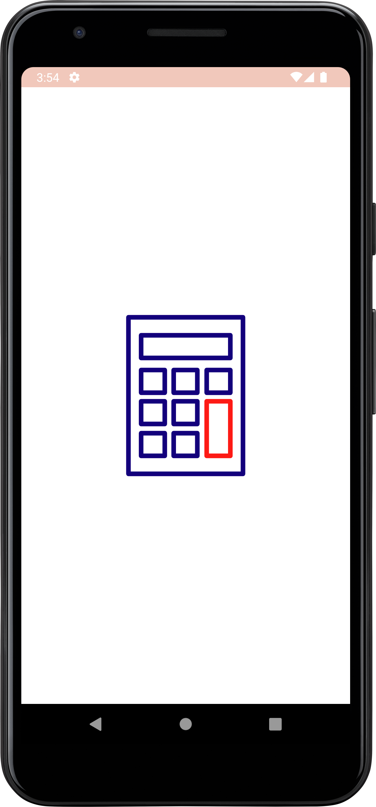
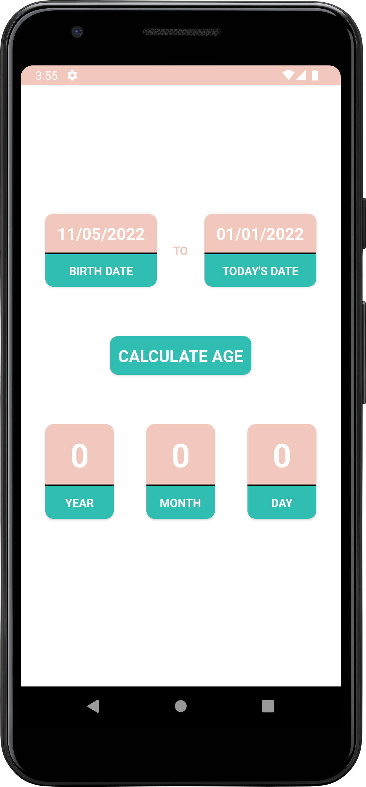
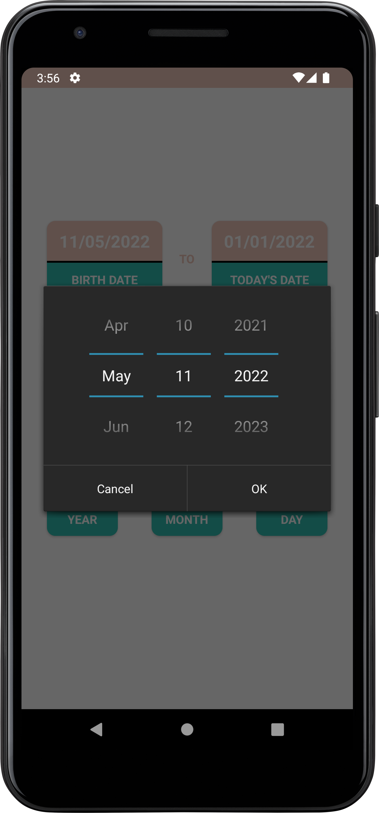
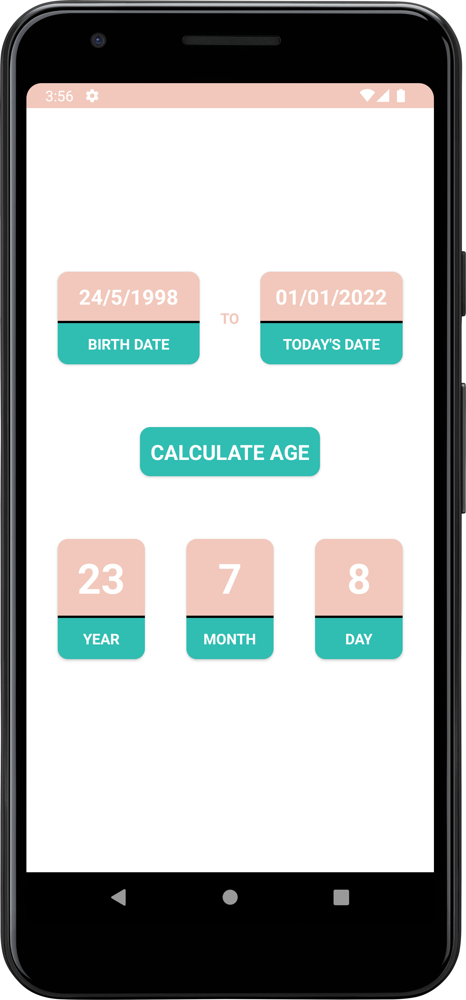
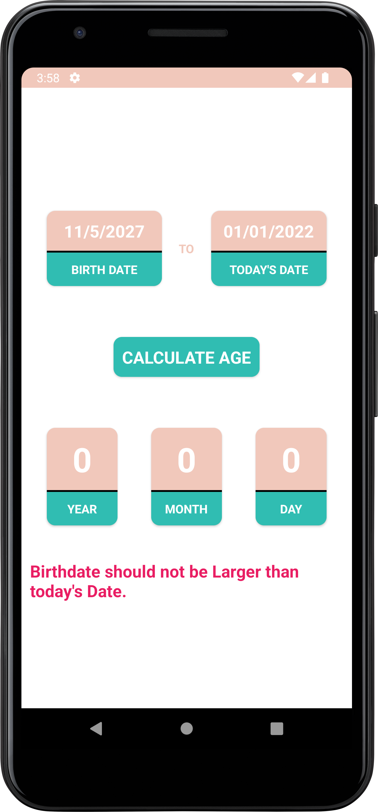

# Калькулятор возраста
Тема курсовой: "Контроль выполнения программного кода мобильного приложения OC Android"

### Фото на память:

|                      Окно загрузки                       |                          Дом                           |                            Выборка                            |
|:--------------------------------------------------------:|:------------------------------------------------------:|:-------------------------------------------------------------:|
|  |  |  |

|                        Результат                         |                     Ошибка в Валидаторе                      | 
|:--------------------------------------------------------:|:------------------------------------------------------------:| 
|  |  |
